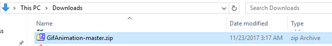
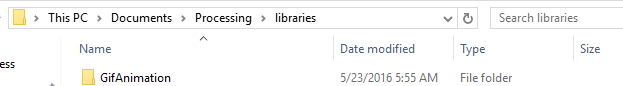
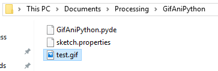

# Use Processing's Python mode to make an animated GIF
### Step 1: Download and install the `gifAnimation` processing library
Go to [https://github.com/01010101/GifAnimation](https://github.com/01010101/GifAnimation) and download [GifAnimation.zip](https://github.com/01010101/GifAnimation/archive/master.zip). You should now have a folder called `GifAnimation-master.zip` in your downloads folder. It should look similar to this:    

    
Extract the folder, rename it as `GifAnimation` and copy it to your Processing library folder. On my Windows PC, the path to my libraries folder is `C:\Users\Art\Documents\Processing\libraries`. Here's a screenshot of the my `GifAnimation` folder in my Processing libraries folder:   

   

### Step 2: Write a Python Processing program
Here's the Python Processing program I'm going to convert to an animated gif. It's an animation of a series of circles:   

```Python
diameter = 10
def setup():
    size(200,200)
    smooth()
    frameRate(2) #screen is drawn 2 times a second, does not effect speed of gif animation

def draw():
    global diameter
    ellipse(100,100,diameter,diameter)
    diameter = diameter + 10
    print(frameCount)
  ```
  
If you run the program, you'll notice that after `frameCount` reaches 29 or so, the circle is so big that it fills the screen. After that there is no noticeable change in the appearance of the animation.
### Step 3: Modify the program to use the `gifAnimation` processing library
Now we are going to add the code that allows us to export the animation as a gif file. The new program is:   

```Python
add_library('gifAnimation')

diameter = 10
def setup():
    size(200,200)
    global gifExport
    gifExport = GifMaker(this, "test.gif")
    gifExport.setRepeat(0) # make it an "endless" animation
    gifExport.setQuality(255)  # quality range 0 - 255
    smooth()
    frameRate(2) #screen is drawn 2 times a second, does not effect speed of gif animation

def draw():
    global diameter
    ellipse(100,100,diameter,diameter)
    diameter = diameter + 10
    print(frameCount)
    export()

def export(): 
  if(frameCount < 29): 
    gifExport.setDelay(500) #half second delay, this is where the gif animation speed is set
    gifExport.addFrame()
  else: 
    gifExport.finish()
    print("gif saved")
    exit()
  ```
  
Note that the code in `export()` checks to see if `frameCount` has reached 29. If it has, the gif is finished and `exit()` is called to quit the program. 
### Step 4: Find the animated gif in the sketch folder
After you run the modified program, there will now be an animated gif in the sketch folder. Here's what mine looked like:   

   

Double click on `test.gif` and you should see your animation:   

    

You can find out more details on the `gifAnimation` library at the sites that I used to create this page: 
- [https://github.com/01010101/GifAnimation](https://github.com/01010101/GifAnimation)
- [https://gist.github.com/jordanorelli/4992290](https://gist.github.com/jordanorelli/4992290)

Thanks to [Jordan Orelli](https://github.com/jordanorelli) for creating the `gifAnimation` library and [01010101](https://github.com/01010101) for porting it to Processing 3.X.

